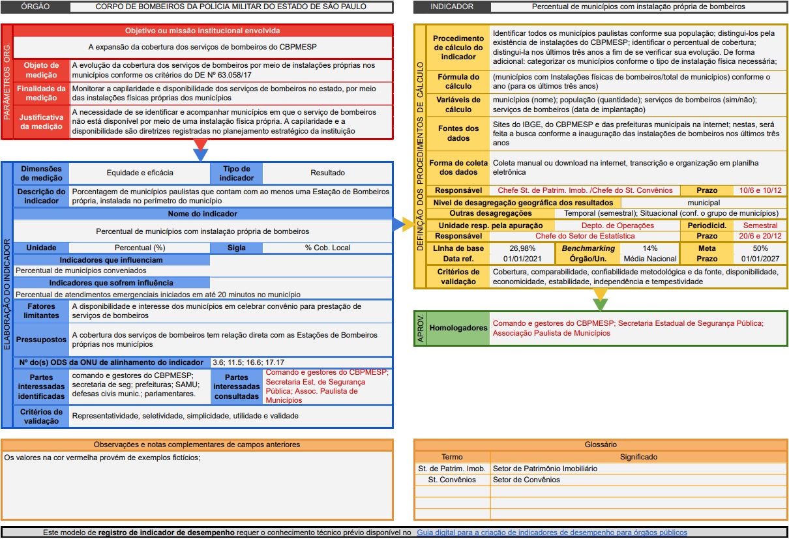

# 3ª e 4ª fases

## 3ª fase - Definição

### 11. Definir os atributos dos elementos de cálculo do indicador

Após a validação e aprovação do indicador com as partes interessadas, pode-se investir tempo e recursos na sua definição, especificamente por meio de seus elementos de cálculo:

#### Realização dos cálculos

<table data-header-hidden><thead><tr><th width="200" align="center"></th><th></th></tr></thead><tbody><tr><td align="center"><mark style="color:orange;"><strong>PROCEDIMENTO DE CÁLCULO</strong></mark></td><td>Identificar todos os municípios paulistas conforme sua população; distingui-los pela existência de instalações do CBPMESP; identificar o percentual de cobertura; distingui-la nos últimos três anos a fim de se verificar sua evolução. De forma adicional: categorizar os municípios conforme o tipo de instalação física necessária. </td></tr><tr><td align="center"><mark style="color:orange;"><strong>FÓRMULA DE CÁLCULO</strong></mark></td><td>(municípios com Instalações físicas de bombeiros/total de municípios) conforme o ano (para os últimos três anos).</td></tr><tr><td align="center"><mark style="color:orange;"><strong>VARIÁVEIS DO CÁLCULO</strong></mark></td><td>municípios (nome); população (quantidade); serviços de bombeiros (sim/não); serviços de bombeiros (data de implantação).</td></tr></tbody></table>

#### Definição e coleta de dados&#x20;

<table data-header-hidden><thead><tr><th width="195" align="center"></th><th></th></tr></thead><tbody><tr><td align="center"><mark style="color:orange;"><strong>FONTES DOS DADOS</strong></mark></td><td><em>Sites</em> do <a href="https://www.ibge.gov.br/cidades-e-estados">IBGE</a>, do <a href="http://www.ccb.policiamilitar.sp.gov.br/portalcb/downloads/Enderecos_SAT_2022mar.pdf">CBPMESP</a> e das prefeituras municipais na internet; nestas, será feita a busca conforme a inauguração das instalações de bombeiros nos últimos três anos.</td></tr><tr><td align="center"><mark style="color:orange;"><strong>FORMA DE COLETA DOS DADOS</strong></mark></td><td>Coleta manual ou <em>download</em> na internet, transcrição e organização em planilha eletrônica.</td></tr></tbody></table>

#### Forma e nível de desagregação dos resultados

<table data-header-hidden><thead><tr><th width="194" align="center"></th><th></th></tr></thead><tbody><tr><td align="center"><mark style="color:orange;"><strong>DESAGREGAÇÃO GEOGRÁFICA</strong></mark></td><td>Em nível municipal.</td></tr><tr><td align="center"><mark style="color:orange;"><strong>OUTRAS DESAGREGAÇÕES</strong></mark></td><td>Temporal (semestral); situacional (conforme o grupo de municípios). </td></tr></tbody></table>

#### Parâmetros comparativos e metas

<table data-header-hidden><thead><tr><th width="182" align="center"></th><th width="94" align="center"></th><th width="231" align="center"></th><th></th></tr></thead><tbody><tr><td align="center"><mark style="color:orange;"><strong>LINHA DE BASE</strong></mark></td><td align="center">26,98%</td><td align="center"><mark style="color:orange;"><strong>DATA DA LINHA DE BASE</strong></mark></td><td>01/01/2021</td></tr><tr><td align="center"><em><mark style="color:orange;"><strong>BENCHMARKING</strong></mark></em> </td><td align="center">14%</td><td align="center"><mark style="color:orange;"><strong>INSTITUIÇÃO E DATA</strong></mark></td><td><a href="https://g1.globo.com/fantastico/noticia/2013/04/apenas-14-das-557-mil-cidades-brasileiras-tem-corpo-de-bombeiros.html">Média nacional</a> 07/04/2013</td></tr><tr><td align="center"><mark style="color:orange;"><strong>META</strong></mark></td><td align="center"><mark style="color:purple;"><strong>50%</strong></mark></td><td align="center"><mark style="color:orange;"><strong>PRAZO DA META</strong></mark></td><td><mark style="color:purple;"><strong>01/01/2027</strong></mark></td></tr></tbody></table>

#### Periodicidade dos procedimentos

<table data-header-hidden><thead><tr><th width="194" align="center"></th><th></th></tr></thead><tbody><tr><td align="center"><mark style="color:orange;"><strong>PERIODICIDADE</strong></mark></td><td><mark style="color:purple;"><strong>Semestral.</strong></mark></td></tr><tr><td align="center"><mark style="color:orange;"><strong>PRAZO FINAL PARA A COLETA DE DADOS</strong></mark></td><td><mark style="color:purple;"><strong>Dias 10 de junho e 10 de dezembro de cada ano.</strong></mark></td></tr><tr><td align="center"><mark style="color:orange;"><strong>PRAZO FINAL  PARA A APURAÇÃO</strong></mark></td><td><mark style="color:purple;"><strong>Dias 20 de junho e 20 de dezembro de cada ano.</strong></mark></td></tr></tbody></table>

#### Definição de responsabilidades

<table data-header-hidden><thead><tr><th width="209" align="center"></th><th></th></tr></thead><tbody><tr><td align="center"><mark style="color:orange;"><strong>UNIDADE RESPONSÁVEL</strong></mark></td><td><mark style="color:purple;"><strong>Departamento de Operações do CBPMESP.</strong></mark></td></tr><tr><td align="center"><mark style="color:orange;"><strong>RESPONSABILIDADE PELA COLETA DE DADOS</strong></mark></td><td><mark style="color:purple;"><strong>Chefe do Setor de Patrimônio Imobiliário e chefe do Setor de Convênios.</strong></mark></td></tr><tr><td align="center"><mark style="color:orange;"><strong>RESPONSABILIDADE PELA APURAÇÃO</strong></mark></td><td><mark style="color:purple;"><strong>Chefe do Setor de Estatística.</strong></mark></td></tr></tbody></table>

### 12. Validação conforme os critérios referentes ao cálculo dos indicadores

Tal como a Etapa 9, nesta etapa serão aplicados todos os critérios de validação referentes aos elementos de cálculo dos indicadores.

<table data-view="cards"><thead><tr><th align="center"></th><th align="center"></th><th></th></tr></thead><tbody><tr><td align="center">✅</td><td align="center"><mark style="color:orange;"><strong>COBERTURA</strong></mark></td><td>O indicador apresenta plena capacidade de abrangência territorial, temporal e situacional.</td></tr><tr><td align="center">✅</td><td align="center"><mark style="color:orange;"><strong>COMPARABILIDADE</strong></mark></td><td>Permite comparações com outras referências.</td></tr><tr><td align="center">✅</td><td align="center"><mark style="color:orange;"><strong>CONFIABILIDADE DA FONTE</strong></mark></td><td>Os dados para geração provêm de fontes confiáveis.</td></tr><tr><td align="center">✅</td><td align="center"><mark style="color:orange;"><strong>CONFIABILIDADE METODOLÓGICA</strong></mark></td><td>Os processos de geração estão definidos e formalizados, permitindo  sua replicação.</td></tr><tr><td align="center">✅</td><td align="center"><mark style="color:orange;"><strong>DISPONIBILIDADE</strong></mark></td><td>Os dados para  cálculo são facilmente obtidos.</td></tr><tr><td align="center">✅</td><td align="center"><mark style="color:orange;"><strong>ECONOMICIDADE</strong></mark></td><td>Os benefícios da geração do indicador superam facilmente os custos.</td></tr><tr><td align="center">✅</td><td align="center"><mark style="color:orange;"><strong>ESTABILIDADE</strong></mark></td><td>O objeto de medição possui constância para proporcionar medições estáveis.</td></tr><tr><td align="center">✅</td><td align="center"><mark style="color:orange;"><strong>INDEPENDÊNCIA</strong></mark></td><td>Fatores não controláveis possuem baixa influência nos resultados.</td></tr><tr><td align="center">⛔</td><td align="center"><mark style="color:orange;"><strong>SUPORTE TÉCNICO</strong></mark></td><td>Não avaliado.</td></tr><tr><td align="center">✅</td><td align="center"><mark style="color:orange;"><strong>TEMPESTIVIDADE</strong></mark></td><td>O resultado é apurável em tempo hábil para a adoção de medidas corretivas.</td></tr></tbody></table>

***

## 4ª fase - Aprovação

Como o indicador <mark style="color:orange;">**Percentual de municípios com instalações próprias**</mark> <mark style="color:orange;">**de bombeiros**</mark> foi validado na etapa anterior, ele é considerado construído, restando as etapas de homologação e seleção. Para a homologação, pode-se apresentar o indicador por meio de seu registro:

<figure><figcaption></figcaption></figure>

A etapa de homologação será considerada atendida diante da condição de elaboração deste exemplo. Já a etapa seguinte, não se aplica, uma vez que se tem apenas um indicador homologado, não carecendo de seleção dentro de uma quantidade possível de indicadores.&#x20;

***

Após a aplicação de todas as etapas do processo de construção do indicador de desempenho (dentro das condições e restrições deste exemplo) a subseção seguinte ilustrará o mesmo exemplo, com a inclusão dos resultados do indicador conforme os <mark style="color:orange;">**atributos e critérios de validação de resultados**</mark> apresentados nas Subseções 2.3.2 e 2.3.3 respectivamente. <mark style="color:orange;">**Trata-se de um oportuno complemento**</mark> para sugerir _insights_ aos leitores, demonstrando que é possível iniciar as atividades de relato de resultados sem a necessidade de grandes sistemas interligados, tecnologias e _dashboards,_ muito embora sejam altamente recomendáveis e facilitem de sobremaneira o processo.
